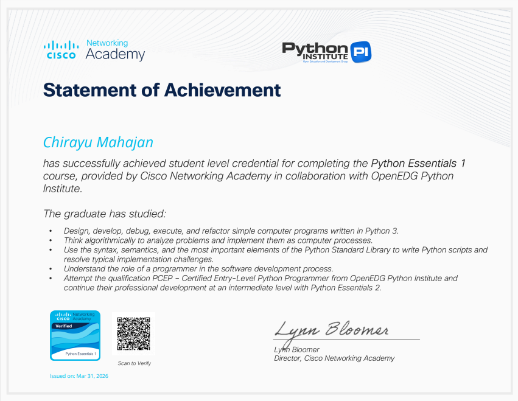
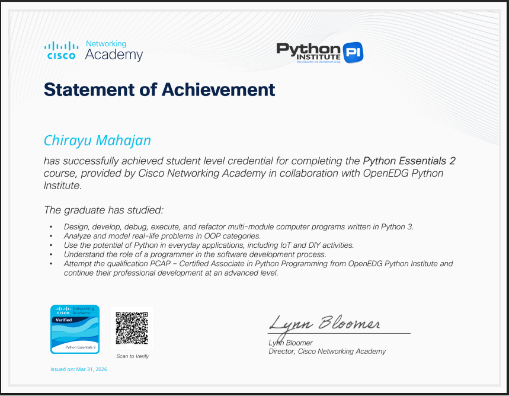

# 🧠 Decision Making in Python (if-else)

This project provides a beginner-friendly explanation of **decision-making in Python** using conditional statements like:

- `if`
- `if-else`
- `elif`
- Nested conditions

It includes a clear video explanation along with verified certifications.

---

## 🎥 Video Explanation

---

## 🏆 Certifications

### Python Essentials 1 – Cisco Networking Academy

### Python Essentials 2 – Cisco Networking Academy

---

## 📂 Concepts Covered

- Conditional Statements
- Boolean Expressions
- Flow Control
- Real-life Decision Logic in Code

---

## 🚀 How to Use

1. Watch the video for explanation  
2. Go through examples (if added)  
3. Practice writing your own conditions  

---

## 📌 About

This project is created as part of learning and explaining core Python concepts in a simple and practical way.

---
